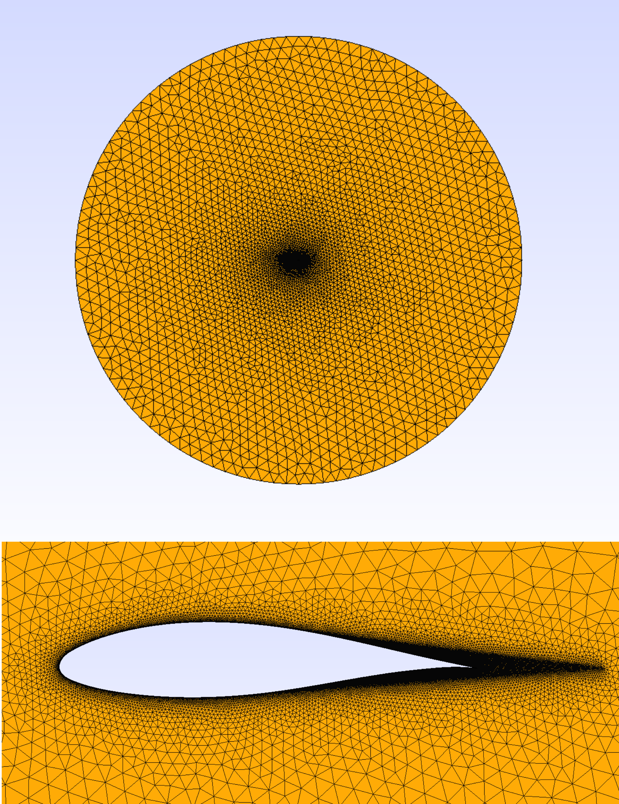

# `GMSHFoil`
A simple class to create a 2D mesh for an airfoil in GMSH using python.

## Requirements

```
pip install airfoils
pip install gmsh==4.8.0
pip install numpy
```

## Usage
Script to create a mesh using a dat file with airfoil coordinates:

```
python3 gmsh_foil_run.py -i your_file.dat \
  --output-mesh-file-name 'mesh_name'\
  --view 0

```


Script to create a mesh with a NACA airfoil:

```
python3 gmsh_foil_run.py --foil-number-string 4812 \
  --output-mesh-file-name 'NACA_4812'\
  --view 0

```

## Results:


